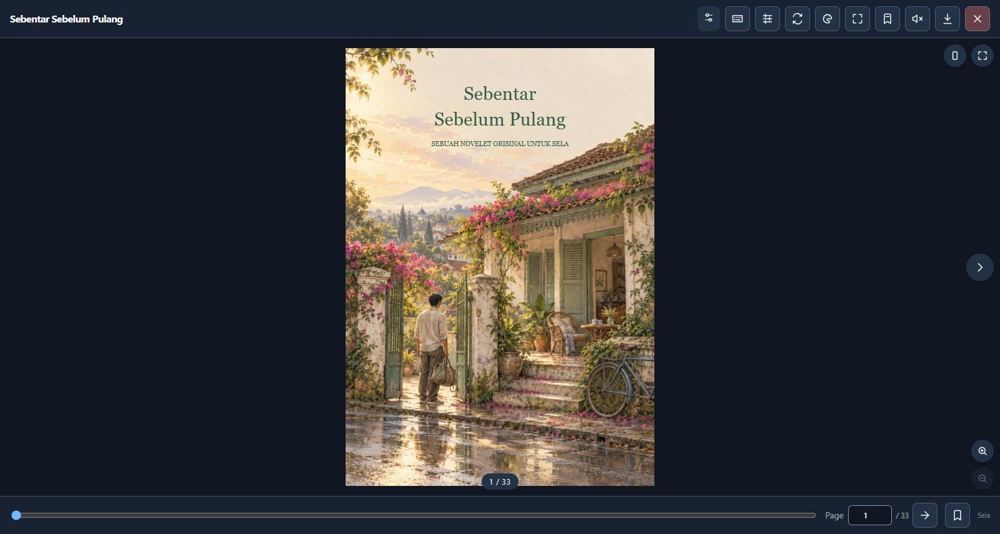

<p align="center"></p>
<h1 align="center">Sela Reader</h1>
<p align="center"><strong>Your books. Anywhere. 📖</strong><br>PDF · EPUB · CBZ · TXT · Markdown · HTML · FB2 · optional DjVu<br>Book flip · Manga RTL · Seamless webtoon · Single page</p>
<p align="center"><a href="https://github.com/bobbyfch/sela/actions/workflows/ci.yml"></a>  <a href="https://github.com/bobbyfch/sela/releases/latest"></a>  </p>

[Live playground](https://bobbyfch.github.io/sela/) · [Bahasa Indonesia](README.id.md) · [Integrations](docs/integrations.md) · [Formats](docs/formats.md) · [Browser support](docs/compatibility.md) · [Changelog](CHANGELOG.md)

**Sela** means an interval: a space between things, and a moment to make room for a story. Open Sela Reader: your private offline bookshelf on desktop, tablet and phone, installable from your browser. Sela Viewer is the lightweight CDN foundation for websites. **No Bootstrap, jQuery or icon font required.** PDF.js loads only for PDFs; EPUB and CBZ use a separate lazy adapter. Optional DjVu integration uses an externally supplied decoder.

🇮🇩 [Baca panduan lengkap dalam Bahasa Indonesia →](README.id.md)

[](https://bobbyfch.github.io/sela/)

[](https://bobbyfch.github.io/sela/#install-viewer) [](https://github.com/bobbyfch/sela/releases/latest)

[](https://bobbyfch.github.io/sela/#install-mobile)

## Reader + Viewer

| Sela Reader | Sela Viewer |
| --- | --- |
| Installable web app: desktop, tablet and phone; private local library | Lightweight CDN / ESM plugin for websites and frameworks |

[Choose / install on the public page](https://bobbyfch.github.io/sela/#products) · [Product guide](docs/products.md)

> Reading and library features are included in 1.3.0. Cloud backup sharing is manual; automatic account sync is not configured.

## ✨ Why Sela?

| Read your way | Fit your project |
| --- | --- |
| 📖 Book folds and two-page spreads | Vanilla JavaScript + ESM |
| 🗯️ Manga RTL turns and arrow keys | TypeScript declarations, SSR-safe import |
| 📜 Webtoon with nearby-page rendering | Vue component; additional integration examples |
| 🎯 Responsive single-page focus | Bootstrap/Tailwind can stay in your app |
| 🌗 Themes and reduced motion | Auth headers, credentials, byte-data PDFs |
| 🔖 Bookmarks and saved progress | Lazy PDF.js and bounded canvas sizes |
| 🎨 12 filters, brightness and dim controls | Compatibility entry with direct-PDF fallback |

[Read **Yang Tidak Ikut Pulang**, an original 50-page Indonesian novelet](https://bobbyfch.github.io/sela/#demo-heading): twelve chapters, four minimalist pencil/pastel illustrations, embedded PDF bookmarks and complete EPUB navigation. Bobby finds a recording that remembers what he has not said. A quiet mystery about a house, borrowed memories and a missing answer. [Story, licensing and illustration prompts](example/story/README.md).

## 🧩 Load only what you read

| Module | Gzip size | Loaded when |
| --- | ---: | --- |
| Main interface | ~26.6 KiB | Main script requested |
| Scoped CSS | ~3.9 KiB | First open |
| EPUB / CBZ adapter (includes fflate) | ~10.7 KiB | EPUB or CBZ selected |
| Reading tools: contents, search, notes, TTS | ~9.6 KiB | Tools first opened |
| Plain text / Markdown / HTML / FB2 | ~3.0 KiB | Text format selected |
| DjVu adapter | ~1.4 KiB | DjVu selected; external decoder also needed |
| PDF.js + worker (modern) | ~491 KiB combined | PDF selected; fonts/CMaps may load separately |

The interface is lightweight; total download depends on the document and decoder. [Format capabilities, archive limits and licensing](docs/formats.md).

## 📚 Pick your format

| Document | Experience | Current scope |
| --- | --- | --- |
| PDF | Book · single · manga RTL · webtoon | Canvas pages; embedded outline, optional search, selectable transcript, narration and page notes; no aligned PDF text layer or OCR |
| EPUB | Selectable text · chapter reading · continuous chapters | Reflowable HTML, reader typography; navigation/NCX, anchor links; no encrypted resources or publisher layout fidelity |
| CBZ | Comic pages in all four modes | Naturally sorted raster images supported by the browser |
| TXT / MD / HTML / FB2 | Selectable reflowable text | UTF-8; basic Markdown headings/fences, safe HTML, text-only FB2; heading outline |
| DjVu | Scanned pages in all four modes | Bundled single-file documents; separately supplied external decoder |

```js
const reader = new Sela({
  url: '/books/story.epub', // EPUB / CBZ / DjVu inferred from URL extension
  language: 'en', mode: 'webtoon', theme: 'auto', pageGap: 0
});
await reader.open();
```

Set `format: 'epub'`, `'cbz'` or `'djvu'` explicitly for Blob URLs, byte data and extensionless endpoints. DjVu also requires `djvujsSrc`; its GPL-2.0 decoder is not part of the MIT bundle. CBR/RAR, MOBI/AZW, DOCX and DRM are not supported in this release. [Full format guide](docs/formats.md).

## 🎛️ Read, tweak, repeat

Use `pageGap: 0` for seamless webtoon, `paperTexture: true` for subtle grain on book faces, `duration: 560` for eased folds, and `wheelZoom: true` to opt into ordinary mouse-wheel zoom. Ctrl + wheel / trackpad pinch zooms without changing ordinary scrolling; touch pinch is also supported. EPUB zoom changes text size.

| Shortcut | Action |
| --- | --- |
| Arrow keys / Page Up / Page Down | Previous / next; manga arrows follow RTL |
| Home / End | First / last page or chapter |
| + / − / 0 | Zoom in / out / reset |
| F / B / M | Fullscreen / bookmark / page sound |
| ? / Escape | Shortcut help / dismiss help or close reader |
| Ctrl/Cmd + F | Search within this document |

Shortcuts ignore editable fields. Reduced motion overrides fold duration. The playground exposes settings before opening and inside the reader.

Set `language: 'en'` for English reader controls or `'id'` for Indonesian (the default retained for existing integrations). The Pages topbar selects the demo language.

Use the Appearance tab for twelve page filters, document brightness and dimmed controls. These also work through `new Sela({brightness: .8, dim: true})`, `reader.setBrightness(.8)` and `reader.setDim(true)`. Filters affect presentation only; original files remain intact.

## 🎧 Listen, find, keep

Open **Reading tools** in the reader header (seven keyboard-accessible icon tabs: mode, contents, search, appearance, voice, notes, text), or call `await reader.showTools()`. Change modes and fit while reading, save global/per-book preferences, adjust text typography, and use low power or manual crop. Embedded PDF bookmarks resolve to their page; EPUB navigation/NCX opens chapters and anchors. Search scans pages sequentially, can be cancelled, and caps results at 100 matching pages. `await reader.getText(page)` returns extractable text. Scans and image comics need external OCR before narration/search can work. [Reading API, highlights, optional audio adapter and backup](docs/reading-experience.md).

**TTS uses the Web Speech API:** no Sela API key, paid SDK, server or model download. Local voices are selected by default; enable online voices explicitly if desired. Voices/languages come from the browser/OS. Remote voices may send narration text to their provider; local voice availability, audible quality, pause/resume and background playback vary. No guaranteed free third-party voice service or Indonesian voice is promised. Speech is chunked, user-started and cancelled on manual navigation or close. Optional continuous narration advances pages/chapters.

Write page/chapter notes; export/import a versioned JSON file with notes and personal bookmarks. Import merges the current book's notes by page/chapter number: use the same document edition. Notes are not geometric PDF highlights. EPUB chapter and relative scroll position resume on reopen; stable EPUB CFI locations are future work.

## 📚 Sela Reader — your private reading room

A local library with Home, Shelf, Explore and Settings, collections, favorites, sorting, grid/list views and ZIP backup. Open the web app on desktop, tablet or phone; install through the browser menu when supported. Touch devices get bottom navigation; wide screens get a side rail. Theme, language and backup live in Settings. You can bookmark the app or set its URL as your browser home page; no browser extension is required.

The current sample has Read / Save offline actions. New novels are a later content phase. Cloud backup uses manual export/share and restore, not automatic account sync. [Installation and offline limits](docs/pwa.md).

## 🌿 Born as Sela 1.0

Sela launched at **1.0.0**; the current release is **1.3.0**. Project, package, Pages and CDN use Sela. Source: [bobbyfch/sela](https://github.com/bobbyfch/sela). FlippyPDF is retired; migrate active consumers to Sela. Public CDN caches cannot be recalled. The legacy v3 release was removed with a local recovery backup. Legacy API/file aliases remain for migration; new integrations use Sela. Npm registry publication is pending; install from the GitHub tag. [Migration guide](docs/migration.md).

Pages uses a first-visit IP country lookup through [country.is](https://country.is/): Indonesia defaults to Indonesian, other countries to English. Saved manual choice wins; a 2.5-second failure falls back to browser language. `?geo=off` disables the lookup. No document, precise device location or browser history is sent. The embed library makes no IP lookup; use `language: 'auto'` for browser language or supply `en`/`id` from your host.

## Quick start

[](docs/install.md)

Choose **Reader** for a personal library, or **Viewer** for embedding in a website. [Open the app](https://bobbyfch.github.io/sela/mobile/) · [Viewer installation](docs/install.md).

## Reading API

`open()` returns a promise; `close()`/`destroy()` cancel work. Controls: `next()`, `prev()`, `goTo(page)`, `firstPage()`, `lastPage()`, `zoomIn()`, `zoomOut()`, `setZoom(value)`, `toggleFullscreen()`, `setFilter(value)`, `setBrightness(.35 ... 1.25)`, `setDim(boolean)`. Position: `currentPage()` and `totalPages`.

Manga preserves PDF page numbers: `next()` increases the page number; **ArrowLeft** advances in RTL. Source pages must already be in reading order. `readingDirection: 'rtl'` also works with book/single.

Filters: `none`, `grayscale`, `sepia`, `contrast`, `warm`, `cool`. Grayscale avoids relying on hue; warm/cool presets are personal adjustments, not medical color-blindness correction. Filters affect canvases, never the source PDF/download.

Events: `ready`, `pagechange`, `pageerror`, `close`, `error`; payloads are in `event.detail`. Options include `presentation`, `container`, `format`, `language`, `pageGap`, `paperTexture`, `wheelZoom`, `startPage`, `id`, `storagePrefix`, `maxScale`, `maxCanvasPixels`, `duration`, `httpHeaders`, `withCredentials`, `password`, `data`, `assetBase`, `pdfBuild`, `zIndex`. Current zoom is available as `reader.zoom`. [Full declarations](src/index.d.ts).

## Privacy & accessibility

Selected demo documents stay in the browser; no upload or analytics. Bookmarks/progress use localStorage when available. CDN requests follow normal browser networking. Keyboard controls, focus trapping, labelled actions and reduced motion are included. PDFs render to canvases; optional tools provide a selectable text transcript, but this is not an aligned text layer or full tagged-PDF accessibility. Provide an accessible original for screen-reader users. EPUB scripts and external resources are removed. Physical Safari/iOS and mobile device testing remains outstanding; no full WCAG conformance claim is made.

## Development

```sh
npm ci
npm run build
npm test
npm run test:types
npm run test:browser
npm run serve
```

The browser suite covers PDF/EPUB/CBZ/DjVu, real pixels, layouts, RTL, filters, Vue lifecycle, flag/theme controls, mobile settings, archive errors, cancellation and auth headers. CI checks Chromium, Firefox and WebKit; local checks also use Edge. Release checks exercise the viewer and dedicated library; see CI for current results. Platform lists do not imply testing every OS/version or physical devices.

## 🌱 What's next?

[Research & prioritized roadmap](docs/roadmap.md) · [Contributing](CONTRIBUTING.md)

The direction is **one reading interface, optional capabilities, many stacks**. This release implements search/transcripts, document contents, browser narration, page notes and a local shelf. Aligned PDF text layers/highlights, EPUB CFI pagination, MOBI/AZW3, OPDS and synchronization remain roadmap work. Feature parity or performance superiority over Readest/foliate-js is not claimed. Npm-registry distribution is also planned; today's installation uses CDN, GitHub or self-hosted assets.

## Open source 🌱

MIT © Bobby Fajar Christian. Engine adapted from [PDFlipbook](https://github.com/SympleNZ/PDFlipbook) (MIT), PDF renderer [PDF.js](https://github.com/mozilla/pdf.js) (Apache-2.0), ZIP adapter fflate (MIT). External DjVu.js decoder is GPL-2.0 and is not bundled. [Third-party notices](THIRD_PARTY_NOTICES.md).

If Sela makes your project easier to read, a ⭐ helps others find it. Bug reports are welcome: include a reproducible PDF, browser version, mode and console error.

## Created by Bobby

Sela prints a one-time console credit when opened and includes a small source link in the viewer. These are credits, not a promise of search ranking. [Portfolio](https://bobbyfajarc.github.io/) · [Instagram](https://instagram.com/bobby.fch) · [LinkedIn](https://www.linkedin.com/in/bobbyfajarc/) · [GitHub](https://github.com/bobbyfch).

A built-in music player is a future content feature. Optional host-provided audio narration adapters do not include a service or API key.


## Cloud backup

Settings → Download full backup exports books and reading data to ZIP. Share backup prepares the archive; tap again to send it through the phone share sheet to an installed cloud app. Google Drive and OneDrive links are provided for manual upload. Restore imports the downloaded ZIP without replacing existing books or newer notes. No automatic account sync or OAuth credentials are configured.
